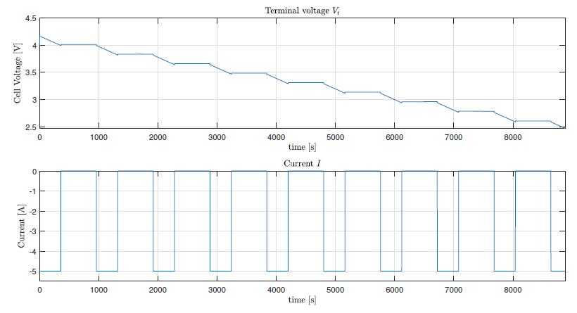
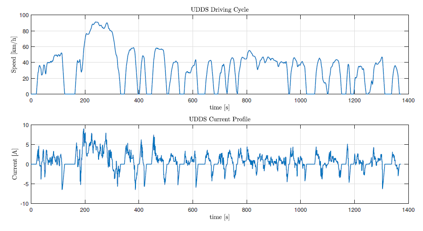

# Lithium-ion Battery State of Charge (SOC) Estimation using Sliding Mode Observer (SMO)

One of the most important features of a BMS is the accurate estimation of the SOC. The BMS controls the charging of battery as per the battery properties and the charge state of the battery. It controls the battery discharging on the basis of the load demand and the charge available in the battery systems. The battery cell voltage levels need to be measured by the BMS to estimate the charge states of the battery cells and to protect the cells from overcharging and undercharging.

The SOC is defined as the ratio between the remaining energy capacity and the actual energy capacity of the battery. The remaining energy is the maximum available capacity in the battery after a specific period of time, and the degradation of electrochemical properties caused by cycling and corrosion has influence in its value. The actual energy is the maximum possible limit of charge in the battery obtained during the initial charge and discharge cycle considering different environmental conditions. Battery SOC does the similar operation of the fuel gauge in a gasoline-driven vehicle which indicates how much energy is left inside a battery to power a vehicle.

Steps to run the Simulink file "soc_estimation.slx":
 - Run the model parameters file "model_parameters.m"
 - Install the driving cycle application running the file ./drivecycle_/install.m
 - Open the Simulink file "soc_estimation.slx" to run the simulation
 - Use the MATLAB files "driving_cycle_smo_plots.m" and "plots_battery_modeling.m" to plot the results depending on the current profile
 
Results for the Li-ion battery modeling for a pulsed discharging profile. 

Current requested by the car using the UDDS driving cycle. 

State of charge (SOC) estimation by the three studied obrservers.

